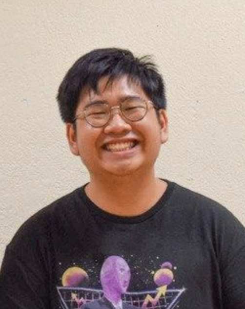
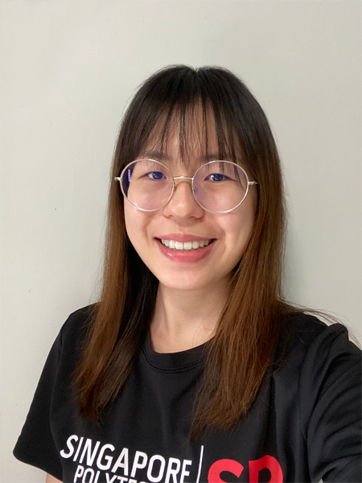
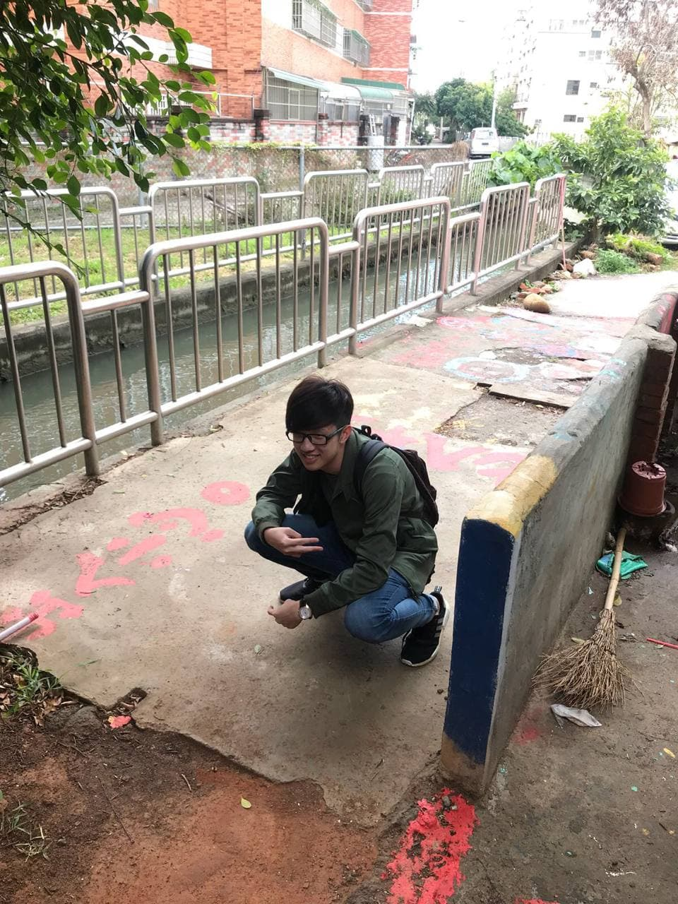

We are a team based in the [School of Computing, National University of Singapore](http://www.comp.nus.edu.sg).

## LinkyTime Project team

### Chua Bing Quan

[[github](https://github.com/chuabingquan)]
[[portfolio](team/chuabingquan.md)]

* Role: Developer
* Responsibilities: Software Design

### Justine Koh Yong Tai

[[github](http://github.com/justinekoh)]
[[portfolio](team/justinekoh.md)]

* Role: Developer
* Responsibilities: Software Design, Deadlines and Deliverables

### Tan Chen Xiang

[[github](https://github.com/xMashedxTomatox)]
[[portfolio](team/xmashedxtomatox.md)]

* Role: Developer
* Responsibilities: Software Design, Deadlines and Deliverables

### Tan Ming Li, Natalie

[[github](http://github.com/NatalieTanML)]
[[portfolio](team/natalietanml.md)]

* Role: Developer
* Responsibilities: Code Quality, Deadlines and Deliverables

### Zhou GuanZong

[[github](http://github.com/Gnoznaug)]
[[portfolio](team/gnoznaug.md)]

* Role: Developer
* Responsibilities: Deliverables and Deadlines
