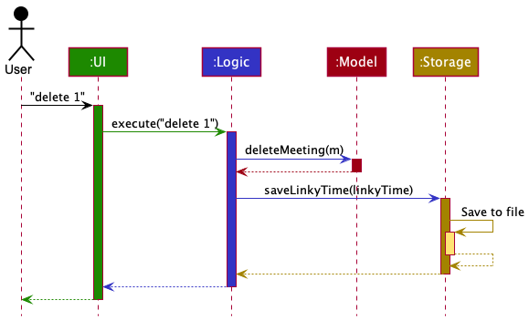
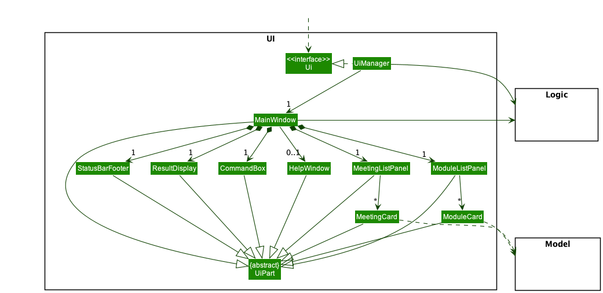
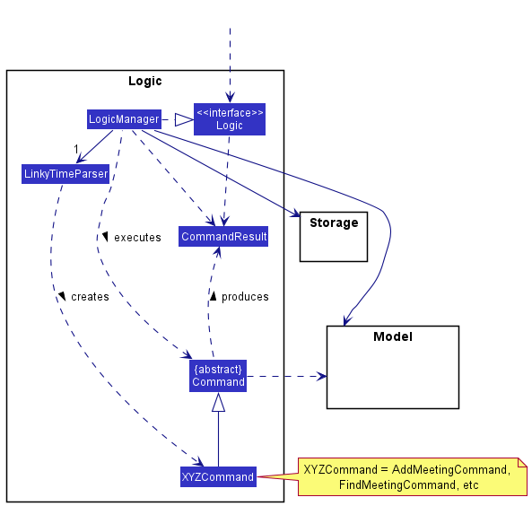
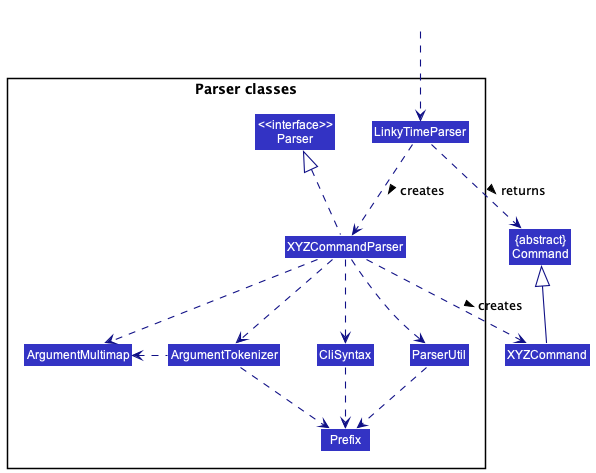
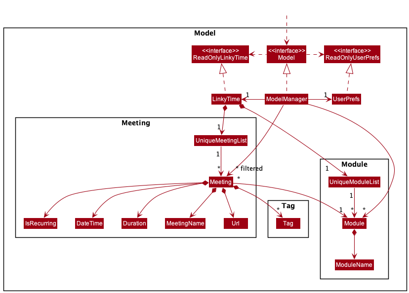
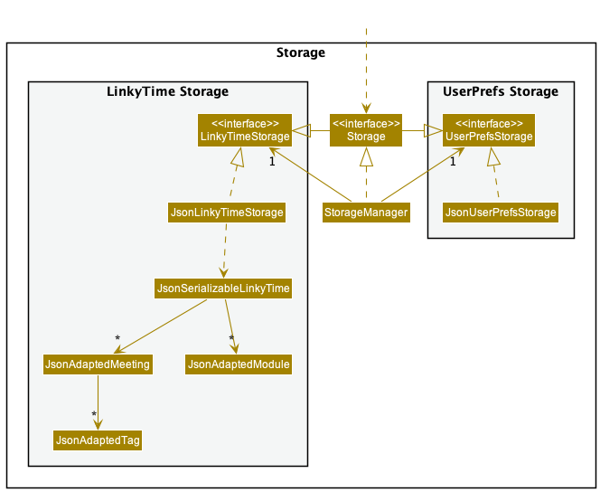

* Table of Contents
{:toc}

--------------------------------------------------------------------------------------------------------------------

## **Acknowledgements**

* This project is based on the AddressBook-Level3 project created by the [SE-EDU initiative](https://se-education.org).
* Libraries used: [JavaFX](https://openjfx.io/), [Jackson](https://github.com/FasterXML/jackson), [JUnit5](https://github.com/junit-team/junit5)
* Logo icon adapted from [AkashRajDahal](https://www.svgviewer.dev/s/12130/link).

--------------------------------------------------------------------------------------------------------------------

## **Setting up, getting started**

Refer to the guide [_Setting up and getting started_](SettingUp.md).

--------------------------------------------------------------------------------------------------------------------

## **Introduction**

**LinkyTime** is a cross-platform desktop application designed for NUS Computer Science students to efficiently keep track of their online meetings and classes. The application is optimized for use via the Command Line Interface (CLI).

This Developer Guide (DG) serves to aid developers in explaining the design, architecture, and implementation of LinkyTime and its features. It also covers design considerations for specific features, and a guide on how to perform manual testing.

--------------------------------------------------------------------------------------------------------------------

## **Design**

:bulb: **Tip:** The `.puml` files used to create diagrams in this document can be found in the [diagrams](https://github.com/AY2122S2-CS2103T-T13-3/tp/tree/master/docs/diagrams/) folder. Refer to the [_PlantUML Tutorial_ at se-edu/guides](https://se-education.org/guides/tutorials/plantUml.html) to learn how to create and edit diagrams.

### Architecture

The ***Architecture Diagram*** given above explains the high-level design of the App.

Given below is a quick overview of main components and how they interact with each other.

**Main components of the architecture**

**`Main`** has two classes called [`Main`](https://github.com/AY2122S2-CS2103T-T13-3/tp/tree/master/src/main/java/seedu/address/Main.java) and [`MainApp`](https://github.com/AY2122S2-CS2103T-T13-3/tp/tree/master/src/main/java/seedu/address/MainApp.java). It is responsible for,
* At app launch: Initializes the components in the correct sequence, and connects them up with each other.
* At shut down: Shuts down the components and invokes clean-up methods where necessary.

[**`Commons`**](#common-classes) represents a collection of classes used by multiple other components.

The rest of the App consists of four components.

* [**`UI`**](#ui-component): The UI of the App.
* [**`Logic`**](#logic-component): The command executor.
* [**`Model`**](#model-component): Holds the data of the App in memory.
* [**`Storage`**](#storage-component): Reads data from, and writes data to, the hard disk.

**How the architecture components interact with each other**

The *Sequence Diagram* below shows how the components interact with each other for the scenario where the user issues the command `delete 1`.

Each of the four main components (also shown in the diagram above),

* defines its *API* in an `interface` with the same name as the Component.
* implements its functionality using a concrete `{Component Name}Manager` class (which follows the corresponding API `interface` mentioned in the previous point.

For example, the `Logic` component defines its API in the `Logic.java` interface and implements its functionality using the `LogicManager.java` class which follows the `Logic` interface. Other components interact with a given component through its interface rather than the concrete class (reason: to prevent outside component's being coupled to the implementation of a component), as illustrated in the (partial) class diagram below.

The sections below give more details of each component.

### UI component

The **API** of this component is specified in [`Ui.java`](https://github.com/AY2122S2-CS2103T-T13-3/tp/tree/master/src/main/java/seedu/address/ui/Ui.java)

The UI consists of a `MainWindow` that is made up of parts e.g.`CommandBox`, `ResultDisplay`, `MeetingListPanel`, `StatusBarFooter` etc. All these, including the `MainWindow`, inherit from the abstract `UiPart` class which captures the commonalities between classes that represent parts of the visible GUI.

The `UI` component uses the JavaFx UI framework. The layout of these UI parts are defined in matching `.fxml` files that are in the `src/main/resources/view` folder. For example, the layout of the [`MainWindow`](https://github.com/AY2122S2-CS2103T-T13-3/tp/tree/master/src/main/java/seedu/address/ui/MainWindow.java) is specified in [`MainWindow.fxml`](https://github.com/AY2122S2-CS2103T-T13-3/tp/tree/master/src/main/resources/view/MainWindow.fxml)

The `UI` component,

* executes user commands using the `Logic` component.
* listens for changes to `Model` data so that the UI can be updated with the modified data.
* keeps a reference to the `Logic` component, because the `UI` relies on the `Logic` to execute commands.
* depends on some classes in the `Model` component, as it displays the `Meeting` and `Module` objects residing in the `Model`.

### Logic component

**API** : [`Logic.java`](https://github.com/AY2122S2-CS2103T-T13-3/tp/tree/master/src/main/java/seedu/address/logic/Logic.java)

Here's a (partial) class diagram of the `Logic` component:

How the `Logic` component works:
1. When `Logic` is called upon to execute a command, it uses the `LinkyTimeParser` class to parse the user command.
2. This results in a `Command` object (more precisely, an object of one of its subclasses e.g., `AddMeetingCommand`) which is executed by the `LogicManager`.
3. The command can communicate with the `Model` when it is executed (e.g. to add a meeting).
4. The result of the command execution is encapsulated as a `CommandResult` object which is returned back from `Logic`.

Here are the other classes in `Logic` (omitted from the class diagram above) that are used for parsing a user command:

How the parsing works:
* When called upon to parse a user command, the `LinkyTimeParser` class creates an `XYZCommandParser` (`XYZ` is a placeholder for the specific command name e.g., `AddMeetingCommandParser`) which uses the other classes shown above to parse the user command and create a `XYZCommand` object (e.g., `AddMeetingCommand`) which the `LinkyTimeParser` returns back as a `Command` object.
* All `XYZCommandParser` classes (e.g., `AddMeetingCommandParser`, `DeleteModuleCommandParser`, ...) inherit from the `Parser` interface so that they can be treated similarly where possible e.g, during testing.

### Model component

**API** : [`Model.java`](https://github.com/AY2122S2-CS2103T-T13-3/tp/tree/master/src/main/java/seedu/address/model/Model.java)

The `Model` component,

* stores LinkyTime data i.e., all `Meeting` and `Module` objects (which are contained in a `UniqueMeetingList` and a `UniqueModuleList` object respectively).
* stores the currently 'selected' `Meeting` objects (e.g., results of a search query) as a separate _filtered_ list which is exposed to outsiders as an unmodifiable list `ObservableList<Meeting>` and `ObservableList<Module>` that can be 'observed' e.g. the UI can be bound to this list so that the UI automatically updates when the data in the list change.
* stores a `UserPref` object that represents the user’s preferences. This is exposed to the outside as a `ReadOnlyUserPref` objects.
* does not depend on any of the other three components, i.e. `Storage`, `Model`, `UI` (as the `Model` represents data entities of the domain, they should make sense on their own without depending on other components)

### Storage component

**API** : [`Storage.java`](https://github.com/AY2122S2-CS2103T-T13-3/tp/tree/master/src/main/java/seedu/address/storage/Storage.java)

The `Storage` component,
* can save both LinkyTime data and user preference data in json format, and read them back into corresponding objects.
* inherits from both `LinkyTimeStorage` and `UserPrefStorage`, which means it can be treated as either one (if only the functionality of only one is needed).
* depends on some classes in the `Model` component (because the `Storage` component's job is to save/retrieve objects that belong to the `Model`)

### Common classes

Classes used by multiple components are in the `seedu.addressbook.commons` package.

--------------------------------------------------------------------------------------------------------------------

## **Implementation**

This section describes some noteworthy details on how certain features are implemented.

### Meetings
The Meetings component consists of the following set of features: List Meeting, Add Meeting, Edit Meeting, Delete Meeting, Find Meeting, and Opening Meeting URL.

#### The Meeting class
The Meeting class is made up of a `MeetingName`, `MeetingUrl`, `MeetingDateTime`, `Module`, `MeetingDuration`, `IsRecurring`,
`Set<Tag>`, and a set of getter methods that corresponds to these fields.

##### Recurring Meetings
A meeting is recurring if it's set to repeat on a weekly basis. Such meetings would never expire.

This section describes how the start and end date time of a recurring meeting is computed. The key implementation lies in
`getNextRecurrence`, a helper method which computes the next recurrence relative to the current date and time. Since
`getStartDateTime` and `getEndDateTime` utilises `getNextRecurrence`, they inherit the side effect of depending
on the current date and time as well.

Below is an activity diagram describing the execution of `getNextRecurrence`.

#### Design considerations:
**Aspect: How the notion of recurrence is implemented:**

**Alternative 1 (current choice):** `getStartDateTime` and `getEndDateTime` will return their respective date times
relative to the current date time.
* Pros: Easier to implement and integrate with other components such as GUI and storage.
* Cons: Unit-testing is less trivial since `getStartDateTime` and `getEndDateTime` would return different date times
depending on when their test cases are executed.

**Alternative 2:** Generate the next set of recurring meetings to replace the existing ones. This is done at the start
of the program and after each command execution.
* Cons: Implementation would sprawl across different components and more effort is required to ensure correctness.

### Commands
This section explains the general implementation of all commands.
The implementation of all commands in LinkyTime can be split into two general implementation flows: commands with a command-specific parser, and commands without.

#### Commands with a parser
This section explains the general implementation of all commands that require a command-specific parser to handle additional user input.

Below is the sequence diagram for the execution of these commands (denoted by `XYZCommand`) after user input is sent to `LogicManager`. The execution of each command has been omitted due to their differences and will be covered in the respective command sections.

Step 1:
The user enters a command with additional required parameters (requires a command-specific parser) which is then passed to the `LogicManager`.

Step 2:
The `LogicManager` then calls `LinkyTimeParser::parseCommand` for it to figure out what command this is.

Step 3:
The `LinkyTimeParser` parses the user input and creates a command parser for that specific command. (denoted by `XYZCommandParser`)

Step 4:
The command parser is then returned to the `LinkyTimeParser` which then calls `XYZCommandParser::parse` to parse the additional parameters.

Step 5:
The `XYZCommandParser` then creates its respective command (denoted by `XYZCommand`) and returns it to `LogicManager`.

Step 6:
The `LogicManager` then calls `XYZCommand::execute` where the interaction between the command and the model is handled.

Step 7:
The `XYZCommand` then creates a successful `CommandResult` and returns it to the UI.

#### Commands without a parser
This section explains the general implementation of all commands that does not require a command-specific parser.

Below is the sequence diagram for the execution of these commands (denoted by `XYZCommand`) after user input is sent to `LogicManager`. The execution of each command has been omitted due to their differences and will be covered in the respective command sections.

Step 1:
The user enters a command which is then passed to the `LogicManager`.

Step 2:
The `LogicManager` then calls `LinkyTimeParser::parseCommand` for it to figure out what command this is.

Step 3:
The `LinkyTimeParser` parses the user input and creates the respective command object (denoted by `XYZCommand`).

Step 4:
The `XYZCommand` is then returned to the `LogicManager`.

Step 5:
The `LogicManager` then calls `XYZCommand::execute` where the interaction between the command and the model is handled.

Step 6:
The `XYZCommand` then creates a successful `CommandResult` and returns it to the UI.

#### List Meetings feature
This section explains the implementation of the List Meetings feature via the `list` command.
The `ListMeetingCommand` updates the UI to display the details of all upcoming meetings in `LinkyTime`.
This command [does not require a parser](#commands-without-a-parser). 

Below is the sequence diagram reference frame for the execution of `ListMeetingCommand`.

Step 1:
The `LogicManager` calls `ListMeetingCommand::execute` with the returned `ListMeetingCommand`.

Step 2:
The `ListMeetingCommand` then calls `Model::showCompletedMeetings` to update the meeting list to show only upcoming meetings.

Step 3:
The `ListMeetingCommand` then continues its execution as defined by [this](#commands-without-a-parser) sequence diagram.

:information_source: **Note:** The lifeline for `ListMeetingCommand` should continue out of this reference frame, but due to a limitation of PlantUML, the lifeline ends in this diagram.

#### Design considerations:
**Aspect: How `ListMeetingCommand` executes:**

**Alternative 1 (current choice):** `LinkyTimeParser` returns a `ListMeetingCommand` without having a parser.
* Pros: Easier to implement and allows for more flexible user input.
* Cons: All user inputs that contains `list` as its first word will result in the execution of `ListMeetingCommand`,
  including those that don't make sense. E.g. `list abc`

**Alternative 2:** `LinkyTimeParser` uses a `ListMeetingCommandParser` to enforce that the user input cannot have additional params.
* Pros: Provides clear definition of what the user input for a `ListMeetingCommand` should be.
* Cons: Harder to implement and more rigid in nature.

#### Archive Meetings feature
This section explains the implementation of the Archive Meetings feature via the `archive` command.
The `ArchiveMeetingCommand` updates the UI to display the details of all completed meetings in `LinkyTime`.
It is identical in implementation to the `ListMeetingCommand` except for the flip in the boolean that is passed into `Model::showCompletedMeetings`.

#### Add Meeting feature

This section explains the implementation of the Add Meeting feature via the `add` command.
The `AddMeetingCommand` causes the specified meeting to be added to the application.
This command requires several compulsory fields such as the meeting name, URL, date time, duration, module, and whether it is recurring.
There is only one optional field which is the tags of the meeting.
This command [requires a parser](#commands-with-a-parser).

Below is the sequence diagram reference frame for the execution of `AddMeetingCommand`.

Step 1:
The `LogicManager` invokes `AddMeetingCommand::execute`, which in turn calls `Model::addMeeting` to add the
new meeting into the list.

Step 2:
The `Model` will then call its own `updateFilteredMeetingList` method in order to update the model's filter to display
all meetings.

Step 3:
The `AddMeetingCommand` then continues its execution as defined by [this](#commands-with-a-parser) sequence diagram.

##### Design considerations:

**Aspect: How AddMeetingCommand executes:**

* **Alternative 1 (current choice):** Let the `LogicManager` pass the model to the command to execute.
    * Pros: Will not need to expose the model to the individual `AddMeetingCommand`.

* **Alternative 2:** Store the model in the `AddMeetingCommand` itself.
    * Pros: Easier to implement and trace.
    * Cons: The `AddMeetingCommand` might be able to abuse the model by calling the model's other methods.

#### Delete Meeting feature

This section explains the implementation of the Delete Meeting feature via the `delete` command.
The `DeleteMeetingCommand` removes the meeting with the given index from the meeting list. This command requires a
single field: the index of the meeting to be deleted. 
This command [requires a parser](#commands-with-a-parser).

Below is the sequence diagram reference frame for the execution of an `DeleteMeetingCommand`.

Step 1:
The `LogicManager` calls `DeleteMeetingCommand::execute` with the returned `DeleteMeetingCommand`.

Step 2:
The `DeleteMeetingCommand` then calls `Model::deleteMeeting` to remove the target meeting from the list.

Step 3:
The `DeleteMeetingCommand` then continues its execution as defined by [this](#commands-with-a-parser) sequence diagram.

#### Design considerations:

**Aspect: How `DeleteMeetingCommand` executes:**

* Similar to the considerations of the `AddMeetingCommand`, this command is also concerned with the model storage and
  the modification of the underlying model object.

#### Find Meeting feature

This section explains the implementation of the Find Meeting feature via the `find` command. The `FindMeetingCommand`
causes the GUI to only show meetings that matches the given keywords.
This command [requires a parser](#commands-with-a-parser).

Below is the sequence diagram reference frame for the execution of the `FindMeetingCommand`.

Step 1:
`LogicManager` calls `FindMeetingCommand::execute`.

Step 2:
`FindMeetingCommand` calls `Model::updateFilteredMeetingList` with a predicate that describes the criteria for the meetings to be shown.

Step 3:
The `FindMeetingCommand` then continues its execution as defined by [this](#commands-with-a-parser) sequence diagram.

##### Design considerations:

**Aspect: How FindMeetingCommand executes:**

* Similar to the considerations of the `AddMeetingCommand`, this command is also concerned with the model storage and
  the modification of the underlying model object.

**Aspect : Behaviour of find command when multiple keywords are provided:**

* **Alternative 1 (current choice):** Command will return meetings which match **all** the given keywords.
    * Pros: Command can be used to narrow down a search to a small set of desired meetings.
    * Cons: Command may be too restrictive, requiring users to ensure that all keywords provided match the desired
      meetings.

* **Alternative 2:** Command will return meetings which match **at least one** of the given keywords.
    * Pros: Command can be used to find a diverse set of meetings that users may be interested in.
    * Cons: Command cannot be used to narrow down the search; adding more keywords may increase the number of meetings
      returned.

#### Open Meeting Feature

This section explains the implementation of the Open Meeting feature via the `open` command. The `OpenMeetingCommand` causes the application to open the given link in the desktop default browser. This is a command that [requires a parser](#commands-with-a-parser).

Below is the sequence diagram reference frame for the execution of `OpenMeetingCommand`.

Step 1:
`LogicManager` calls `OpenMeetingCommand::execute`.

Step 2:
`OpenMeetingCommand` creates a new `UrlOpenerManager` and calls `OpenMeetingCommand::executeWithUrlOpener` with it.

Step 3:
`OpenMeetingCommand` gets the `Url` from the `Model` and calls `UrlOpenerManager::open` with it.

Step 4:
The `OpenMeetingCommand` then continues its execution as defined by [this](#commands-with-a-parser) sequence diagram.

#### Design considerations:

**Aspect: Which component to handle desktop capabilities:**

* **Alternative 1 (current choice):** Create a `UrlOpener` interface and a `UrlOpenerManager` to handle communication with the desktop.
    * Pros: Ease of testing as the behaviour of the desktop can be mocked using stubs. 
    * Cons: Additional complexity and more areas for bugs.

* **Alternative 2:** Handle all communication with the desktop within `OpenCommand`.
    * Pros: Simpler implementation with less components to maintain.
    * Cons: Much harder to decouple the command logic from the behaviour of the desktop, which may differ according to the environment in which the tests are run. For example, when running tests meant for desktops on GitHub actions (a headless environment without desktop/browser capabilities), the tests for this command will fail.

### Modules

The Modules component consists of the following set of features: Add Module, Edit Module, Delete Module.

All module-related commands are prefixed with an `m` to distinguish it from meeting-related commands.

#### The Module class

The Module class consists of a single field, and input validation happens directly inside the class via `Module::isValidModule`.

The `Module` objects are stored in a `UniqueModuleList` which is held by `LinkyTime`.

##### Design considerations:

* **Alternative 1 (current choice):** Store the module code string directly in the Module object.
  * Pros: Easy to implement and understand.
  * Cons: Difficult to add additional fields in the future.
* **Alternative 2:** Abstract the field out as a separate class.
  * Pros:
    * More object-oriented approach.
    * Responsibility of field verification would be done by the field class instead of the Module class.
  * Cons:
    * Over-abstraction of the Module class for the current implementation which consists of only one field.
    * May not be intuitive to understand at first glance.

As we do not intend to contain any additional fields within the Module object, we opted for a simpler approach in its design.

#### Delete Module feature

This section explains the implementation of the Delete Module feature via the `mdelete` command.

The `DeleteModuleCommand` causes the specified module to be deleted from the application.

If there are meetings that are tagged under this module, the command execution is blocked and an error message is displayed to the user.
This command can be forced, see [below](#force-delete-module-feature).

This process is summarized in the diagram below.

#### Force Delete Module feature

This feature is an extension to the existing Delete Module feature. By supplying an additional force-delete flag (`f/`) to the `DeleteModuleCommand` parameters, this would override the delete restriction and remove the selected modules and its associated meetings.

This command [requires a parser](#commands-with-a-parser). The sequence diagram for the `DeleteModuleCommand` is as shown below.

--------------------------------------------------------------------------------------------------------------------

## **Documentation, logging, testing, configuration, dev-ops**

* [Documentation guide](Documentation.md)
* [Testing guide](Testing.md)
* [Logging guide](Logging.md)
* [Configuration guide](Configuration.md)
* [DevOps guide](DevOps.md)

--------------------------------------------------------------------------------------------------------------------

## **Appendix: Requirements**

### Product scope

**Target user profile**:

Aiken Dueet is a Year 2 NUS Computer Science student. He is currently taking his modules online due to COVID-19. He:

* has a need to manage a large number of online meeting links and details
* prefer desktop apps over other types
* can type fast
* prefers typing to mouse interactions
* is reasonably comfortable using CLI apps

**Value proposition**: manage online meeting links much quicker than a typical mouse/GUI driven app

### User stories

Priorities: High (must have) - `* * *`, Medium (nice to have) - `* *`, Low (unlikely to have) - `*`

| Priority | As a …                       | I want to …                                 | So that I can…                                             |
| -------- | ---------------------------- | ------------------------------------------- | ---------------------------------------------------------- |
| `* * *`  | new user                     | see usage instructions                      | refer to instructions if I forget how to use the App       |
| `* * *`  | user                         | view all my upcoming meetings               | see what meetings I have up next                           |
| `* * *`  | user                         | view all my archived meetings               | see my old meetings that I might have missed               |
| `* * *`  | user                         | add a new meeting                           | add my online lecture details                              |
| `* * *`  | user                         | open a meeting URL                          | open my meeting URL in my browser quickly                  |
| `* * *`  | user                         | edit an existing meeting                    | update my online lecture details                           |
| `* * *`  | user                         | delete a meeting                            | remove old meetings that I don’t need anymore              |
| `* *`    | user with multiple meetings  | search for meetings                         | find my online meetings easily                             |
| `* * *`  | user                         | add a new module                            | add my classes I am taking this semester                   |
| `* *`    | user                         | edit an existing module                     | update a module's details                                  |
| `* * *`  | user                         | delete a module                             | remove old modules I am no longer taking                   |
| `* *`    | user                         | delete a module and its associated meetings | quickly remove old modules and its meetings                |
| `* *`    | user starting a new semester | clear all data                              | remove old meetings and modules from the previous semester |

--------------------------------------------------------------------------------------------------------------------

## **Use cases**

For all use cases below, the **System** is `LinkyTime` and the **Actor** is the `user`, unless specified otherwise.
All use cases are prefixed with `UC`, followed by a three-digit use case number.

### UC-001: List all upcoming meetings

**MSS**

1. User requests to list all upcoming meetings.
2. LinkyTime shows a list of all upcoming meetings.

    Use case ends.

**Extensions**

* 2a. The meeting list is empty.

    Use case ends.

### UC-002: List all archived meetings

**MSS**

1. User requests to list all archived meetings.
2. LinkyTime shows a list of all archived meetings.

    Use case ends.

**Extensions**

* 2a. The meeting list is empty.

    Use case ends.

### UC-003: Add a meeting

**MSS**

1. User requests to add a new meeting to the meeting list.
2. LinkyTime adds a new meeting with given parameters in the meeting list.

    Use case ends.

**Extensions**

* 1a. The user does not include the required parameters with the command.
  * 1a1. LinkyTime shows an error message stating which parameters are required.

    Use case ends.

* 1b. The user does not follow the format of the command.
  * 1b1. LinkyTime shows an error message stating the correct format of the command.

    Use case ends.

* 1c. The new meeting is a duplicate of an existing meeting in the meeting list.
  * 1c1. LinkyTime shows an error message stating that this meeting already exists.

    Use case ends.

### UC-004: Open a meeting

**MSS**

1. User requests to list meetings.
2. LinkyTime shows the list of meetings.
3. User requests to open a specific meeting's URL based on the index from the meeting list displayed in step 2.
4. LinkyTime opens the default browser with the given URL.

    Use case ends.

**Extensions**

* 2a. The meeting list is empty.

    Use case ends.

* 3a. The given index is invalid.
  * 3a1. LinkyTime shows an error message stating that the given index is invalid.

    Use case resumes at step 2.

* 3b. The application does not have permissions to open the browser.
  * 3b1. The application displays an error message.

    Use case ends.

### UC-005: Edit a meeting

**MSS**

1. User requests to list meetings.
2. LinkyTime shows the list of meetings.
3. User requests to edit a specific meeting based on the index from the meeting list displayed in step 2.
4. LinkyTime edits the meeting and saves the changes.

    Use case ends.

**Extensions**

* 2a. The meeting list is empty.

    Use case ends.

* 3a. The given index is invalid.
  * 3a1. LinkyTime shows an error message stating that the given index is invalid.

    Use case resumes at step 2.

* 3b. No arguments were given.
  * 3b1. LinkyTime shows an error message stating that at least one field must be edited.

    Use case resumes at step 2.

* 3c. The user does not follow the format of the command.
  * 3c1. LinkyTime shows an error message stating the correct format of the command.

    Use case resumes at step 2.

* 3d. The edited meeting is a duplicate of an existing meeting in the meeting list.
  * 3d1. LinkyTime shows an error message stating that this meeting already exists.

    Use case resumes at step 2.

### UC-006: Delete a meeting

**MSS**

1. User requests to list meetings.
2. LinkyTime shows a list of meetings.
3. User requests to delete a specific meeting in the meeting list based on the index from the meeting list displayed in step 2.
4. LinkyTime deletes the meeting and saves the changes.

    Use case ends.

**Extensions**

* 2a. The meeting list is empty.

    Use case ends.

* 3a. The given index is invalid.
  * 3a1. LinkyTime shows an error message stating that the given index is invalid.

    Use case resumes at step 2.

### UC-007: Find meetings

**MSS**

1. User searches for a meeting by a search term.
2. LinkyTime shows a list of meetings whose name, tags, or module contains the search term.

    Use case ends.

**Extensions**

* 2a. There are no meetings matching the search term.
  * 2a1. An empty meeting list is displayed.

    Use case ends.

### UC-008: Add a module

**MSS**

1. User requests to add a new module to the module list.
2. LinkyTime adds a new module with given parameters in the module list.

    Use case ends.

**Extensions**

* 1a. The user does not include the required parameters with the command.
  * 1a1. LinkyTime shows an error message stating which parameters are required.

    Use case ends.

* 1b. The user does not follow the format of the command.
  * 1b1. LinkyTime shows an error message stating the correct format of the command.

    Use case ends.

* 1c. The new module is a duplicate of an existing module in the module list.
  * 1c1. LinkyTime shows an error message stating that this module already exists.

    Use case ends.

### UC-009: Edit a module

**MSS**

1. User requests to edit a specific module based on the index from the module list displayed.
2. LinkyTime edits the module and all associated meetings and saves the changes.

    Use case ends.

**Extensions**

* 1a. The module list is empty.

    Use case ends.

* 1b. The given index is invalid.
  * 1b1. LinkyTime shows an error message stating that the given index is invalid.

    Use case resumes at step 1.

* 1c. No arguments were given.
  * 1c1. LinkyTime shows an error message stating that at least one field must be edited.

    Use case resumes at step 1.

* 1d. The user does not follow the format of the command.
  * 1d1. LinkyTime shows an error message stating the correct format of the command.

    Use case resumes at step 1.

* 1c. The edited module is a duplicate of an existing module in the module list.
  * 1c1. LinkyTime shows an error message stating that this module already exists.

    Use case resumes at step 1.

### UC-010: Delete a module

**MSS**

1. User requests to delete a specific module in the module list based on the index from the module list displayed.
2. LinkyTime deletes the module and saves the changes.

    Use case ends.

**Extensions**

* 1a. The module list is empty.

    Use case ends.

* 1b. The given index is invalid.
  * 1b1. LinkyTime shows an error message stating that the given index is invalid.

    Use case resumes at step 1.

* 1c. The module has associated meetings in the meeting list.
  * 1c1. LinkyTime shows an error message stating that the module cannot be deleted due to associated meetings.

    Use case resumes at step 1.

### UC-011: Delete a module and its associated meetings

**MSS**

1. User requests to force delete a specific module and its associated meetings based on the index from the module list displayed.
2. LinkyTime deletes the module and its associated meetings and saves the changes.

    Use case ends.

**Extensions**

* 1a. The module list is empty.

    Use case ends.

* 1b. The given index is invalid.
  * 1b1. LinkyTime shows an error message stating that the given index is invalid.

    Use case resumes at step 1.

### UC-012: Clear all data

**MSS**

1. User chooses to clear all data in LinkyTime.
2. LinkyTime deletes all meetings and modules and saves the changes.

    Use case ends.

**Extensions**

* 2a. The meeting and module lists are empty.

    Use case ends.

### UC-013: Access help

**MSS**

1. User requests to see the list of commands available.
2. LinkyTime opens a dialog box with a link to the User Guide.

    Use case ends.

--------------------------------------------------------------------------------------------------------------------

### Non-Functional Requirements

1. Should work on any _mainstream OS_ as long as it has Java `11` or above installed.
2. Should be able to hold up to 1000 meetings without a noticeable sluggishness in performance for typical usage.
3. A user with above average typing speed for regular English text (i.e. not code, not system admin commands) should be able to accomplish most of the tasks faster using commands than using the mouse.
4. A user should be familiar with the basic commands within half an hour of usage.
5. Should be portable to allow transferring of data between different computers.
6. Should not require an installer.
7. Should not depend on external/remote servers.
8. Should not depend on a Database Management System (DBMS).

### Glossary

* **Mainstream OS**: Windows, Linux, Unix, OS-X.
* **Meeting**: An online class containing the details such as the meeting link, name, date, and other fields.
* **Module**: A self-contained structured unit of study in a specific subject. Also known as course, class.
* **NUS**: The National University of Singapore.
* **Command**: A keyword that defines an action for the program to perform when entered into the command box.

--------------------------------------------------------------------------------------------------------------------

## **Appendix: Instructions for manual testing**

Given below are instructions to test the app manually.

:information_source: **Note:** These instructions only provide a starting point for testers to work on;
testers are expected to do more *exploratory* testing.

### Launch and shutdown

1. Initial launch
   1. Download the jar file and copy into an empty folder.
   2. Double-click the jar file. 
      Expected: Shows the GUI with a set of sample meetings and modules. The window size may not be optimum.

2. Saving window preferences
   1. Resize the window to an optimum size. Move the window to a different location. Close the window.
   2. Re-launch the app by double-clicking the jar file. 
      Expected: The most recent window size and location is retained.

### Meeting

#### Adding Meetings

1. Adding a meeting
   1. Prerequisites:
      1. There is no other meetings with the exact same fields.
      2. There is one module in the module list.
   2. Test case: `add n/Lecture u/https://www.zoom.com d/25-03-2022 1400 dur/1.5 m/1 r/Y t/recorded t/lecturequiz` 
      Expected: Meeting is added.
   
2. Duplicate meeting
   1. Prerequisites:
      1. The test case command was just entered.
   2. Test case: `add n/Lecture u/https://www.zoom.com d/25-03-2022 1400 dur/1.5 m/1 r/Y t/recorded t/lecturequiz`.
3. Incorrect name
   1. Test case: `add n/Lectur$ u/https://www.zoom.com d/25-03-2022 1400 dur/1.5 m/1 r/Y t/recorded t/lecturequiz`.
4. Incorrect URL
   1. Test case: `add n/Lecture u/zoom d/25-03-2022 1400 dur/1.5 m/1 r/Y t/recorded t/lecturequiz`.
5. Incorrect date
   1. Test case: `add n/Lecture u/https://www.zoom.com d/40-03-2022 1400 dur/1.5 m/1 r/Y t/recorded t/lecturequiz`.
6. Incorrect time
   1. Test case: `add n/Lecture u/https://www.zoom.com d/25-03-2022 2500 dur/1.5 m/1 r/Y t/recorded t/lecturequiz`.
7. Incorrect duration
   1. Test case: `add n/Lecture u/https://www.zoom.com d/25-03-2022 1400 dur/25 m/1 r/Y t/recorded t/lecturequiz`.
8. Incorrect module index
   1. Prerequisites:
      1. There is only 1 module in the module list.
   2. Test case: `add n/Lecture u/https://www.zoom.com d/25-03-2022 1400 dur/1.5 m/10 r/Y t/recorded t/lecturequiz`.
9. Incorrect recurrence
   1. Test case: `add n/Lecture u/https://www.zoom.com d/25-03-2022 1400 dur/1.5 m/1 r/A t/recorded t/lecturequiz`.
10. Incorrect tag 
   1. Test case: `add n/Lecture u/https://www.zoom.com d/25-03-2022 1400 dur/1.5 m/1 r/Y t/recorded t/!ecturequiz`. 
   For each of the incorrect commands, there will be an error message included on how to rectify the issue.

#### Editing Meetings

1. Editing a meeting in the meeting list
   1. Prerequisites:
      1. There is at least one meeting in the meeting list. 
   2. Test case: `edit 1 n/Lecture` 
      Expected: The meeting at the first index is edited.

2. Duplicate meeting 
   1. For each field of the meeting, you may refer to [Adding Meetings](#adding-meetings) as they are exactly the same.
   2. Prerequisites:
         1. There is a meeting in the meeting list at index 4 which was added using the command `add n/Lecture u/https://www.zoom.com d/25-03-2022 1400 dur/1.5 m/1 r/Y t/recorded t/lecturequiz`.
         2. There is a meeting in the meeting list at index 1 which was added using the command `add n/Tutorial u/https://www.zoom.com d/25-03-2022 1400 dur/1.5 m/1 r/Y t/recorded t/lecturequiz`.
   3. Test case: `edit 1 n/Lecture` 
      Expected: There will be an error message included on how to rectify the issue.

#### Deleting Meetings

1. Deleting the first meeting in the currently shown meeting list.
   1. Prerequisites: 
      1. There is at least one meeting in the meeting list currently shown.
   2. Test case: `delete 1` 
      Expected: The first meeting in the currently shown meeting list is deleted.

2. Deleting with an non-integer index.
   1. Test case: `delete abc` 
      Expected: Invalid command format error message shown. No meetings deleted.

3. Deleting without an index.
   1. Test case: `delete` 
      Expected: Invalid command format error message shown. No meetings deleted.

4. Deleting with an out-of-bounds index.
   1. Prerequisites: 
      1. There is at least one meeting in the meeting list currently shown.
   2. Test case: `delete [index]`, where `[index]` is an integer greater than the number of meetings in the currently shown list. 
      Expected: Invalid index error message shown. No meetings deleted.

5. Deleting with a negative index.
   1. Prerequisites: 
      1. There is at least one meeting in the meeting list currently shown.
   2. Test case: `delete [index]`, where `[index]` is a negative integer. 
      Expected: Invalid command format error message shown. No meetings deleted.

#### List upcoming meetings

1. Listing all upcoming meetings with multiple meetings in the meeting list.
   1. Prerequisites: 
      1. There are multiple meetings in the meeting list which was added using `AddMeetingCommand`.
   2. Test case: `list` 
      Expected: Only meetings that are ongoing or upcoming will be shown.
   
2. Listing all upcoming meetings with no meetings in the meeting list.
   1. Prerequisites: 
      1. There are no meetings in the meeting list.
   2. Test case: `list` 
      Expected: No meetings will be shown.

3. Adding a ongoing or upcoming meeting after listing all upcoming meetings.
   1. Prerequisites: 
      1. List all upcoming meetings using the `list` command. 
      2. Prerequisites of [Adding Meetings](#adding-meetings).
   2. Test case: Add a meeting that is ongoing or upcoming.  
      Expected: A new meeting should be displayed.
   
4. Adding a completed meeting after listing all upcoming meetings.
   1. Prerequisites: 
      1. List all upcoming meetings using the `list` command. 
      2. Prerequisites of [Adding Meetings](#adding-meetings).
   2. Test case: Add a meeting that is completed.  
      Expected: No new meeting should be displayed.
   
5. Editing the date of an upcoming meeting, updating it to a completed meeting.
   1. Prerequisites: 
      1. List all upcoming meetings using the `list` command. 
      2. Prerequisites of [Editing Meetings](#editing-meetings).
   2. Test case: Edit an existing upcoming meeting, updating its date to make it a completed meeting.  
      Expected: There should be one less meeting in the meeting list shown.

#### List archived meetings

1. Listing all archived meetings with multiple meetings in the meeting list.
   1. Prerequisites: 
      1. There are multiple meetings in the meeting list which was added using `AddMeetingCommand`.
   2. Test case: `archive` 
      Expected: Only meetings that are completed will be shown.

2. Listing all archived meetings with no meetings in the meeting list.
   1. Prerequisites: 
      1. There are no meetings in the meeting list.
   2. Test case: `archive` 
      Expected: No meetings will be shown.

3. Adding a completed meeting after listing all archived meetings.
   1. Prerequisites: 
      1. List all archived meetings using the `archive` command. 
      2. Prerequisites of [Adding Meetings](#adding-meetings).
   2. Test case: Add a meeting that is completed. 
      Expected: A new meeting should be displayed.

4. Adding a ongoing or upcoming meeting after listing all archived meetings.
   1. Prerequisites: 
      1. List all archived meetings using the `archive` command. 
      2. Prerequisites of [Adding Meetings](#adding-meetings).
   2. Test case: Add a meeting that is ongoing or upcoming. 
      Expected: No new meeting should be displayed.
   
5. Editing the date of a completed meeting, updating it to an upcoming meeting.
   1. Prerequisites: 
      1. List all archived meetings using the `archive` command. 
      2. Prerequisites of [Editing Meetings](#editing-meetings).
   2. Test case: Edit an existing archived meeting, updating its date to make it an upcoming meeting. 
      Expected: There should be one less meeting in the meeting list shown.

#### Finding Meetings

1. Finding a meeting in the meeting list by singular name.
   1. Prerequisites:
      1. There is a module in the module list at index 1 named `CS2101`.
      2. There is a meeting in the meeting list which was added using the command `add n/Lecture u/https://www.zoom.com d/25-03-2022 1400 dur/1.5 m/1 r/Y t/recorded t/lecturequiz`.
      3. There is a meeting in the meeting list which was added using the command `add n/Tutorial u/https://www.zoom.com d/25-03-2022 1400 dur/1.5 m/1 r/Y t/recorded t/tutorialquiz` 
      4. There are no other meetings in the meeting list.
   2. Test case: `find Lecture` 
      Expected: The first meeting above will be displayed.
      Test case: `find Tutorial` 
      Expected: The second meeting above will be displayed.

2. Finding a meeting in the meeting list by singular tag.
   1. Prerequisites:
      1. There is a module in the module list at index 1 named `CS2101`.
      2. There is a meeting in the meeting list which was added using the command `add n/Lecture u/https://www.zoom.com d/25-03-2022 1400 dur/1.5 m/1 r/Y t/recorded t/lecturequiz`.
      3. There is a meeting in the meeting list which was added using the command `add n/Tutorial u/https://www.zoom.com d/25-03-2022 1400 dur/1.5 m/1 r/Y t/recorded t/tutorialquiz` 
      4. There are no other meetings in the meeting list.
   2. Test case: `find tutorialquiz` 
      Expected: The second meeting above will be displayed.
      Test case: `find lecturequiz` 
      Expected: The first meeting above will be displayed.
      Test case: `find recorded` 
      Expected: Both meetings above will be displayed.

3. Finding a meeting in the meeting list by singular module.
   1. Prerequisites:
      1. There is a module in the module list at index 1 named `CS2101` and at index 2 named `CS2103T`.
      2. There is a meeting in the meeting list which was added using the command `add n/Lecture u/https://www.zoom.com d/25-03-2022 1400 dur/1.5 m/1 r/Y t/recorded t/lecturequiz`.
      3. There is a meeting in the meeting list which was added using the command `add n/Tutorial u/https://www.zoom.com d/25-03-2022 1400 dur/1.5 m/1 r/Y t/recorded t/tutorialquiz` 
      4. There is a meeting in the meeting list which was added using the command `add n/Lecture u/https://www.zoom.com d/25-03-2022 1400 dur/1.5 m/2 r/Y t/recorded t/lecturequiz`.
      5. There are no other meetings in the meeting list.
   2. Test case: `find CS2101` 
      Expected: The first and second meetings above will be displayed.
      Test case: `find CS2103` (Partial match) 
      Expected: The third meeting above will be displayed.

4. Finding a meeting in the meeting list by a combination of names, modules and tags.
   1. Prerequisites:
      1. There is a module in the module list at index 1 named `CS2101` and at index 2 named `CS2103T`.
      2. There is a meeting in the meeting list which was added using the command `add n/Lecture u/https://www.zoom.com d/25-03-2022 1400 dur/1.5 m/1 r/Y t/recorded t/lecturequiz`.
      3. There is a meeting in the meeting list which was added using the command `add n/Tutorial u/https://www.zoom.com d/25-03-2022 1400 dur/1.5 m/1 r/Y t/recorded t/tutorialquiz` 
      4. There is a meeting in the meeting list which was added using the command `add n/Lecture u/https://www.zoom.com d/25-03-2022 1400 dur/1.5 m/2 r/Y t/recorded t/lecturequiz`.
      5. There are no other meetings in the meeting list.
   2. Test case: `find lecturequiz CS2103T` 
      Expected: The third meeting above will be displayed.
      Test case: `find recorded CS2101 Lecture` 
      Expected: The first meeting above will be displayed.

5. Finding a meeting in an empty meeting list.
   1. Prerequisites: There are no meetings in the meeting list.
   2. Test case: `find this` 
      Expected: No meetings shown.

6. Finding a meeting with keywords that do not fit any meetings.
   1. Prerequisites:
      1. There is a module in the module list at index 1 named `CS2101`.
      2. There is a meeting in the meeting list which was added using the command `add n/Lecture u/https://www.zoom.com d/25-03-2022 1400 dur/1.5 m/1 r/Y t/recorded t/lecturequiz`.
      3. There is a meeting in the meeting list which was added using the command `add n/Tutorial u/https://www.zoom.com d/25-03-2022 1400 dur/1.5 m/1 r/Y t/recorded t/tutorialquiz` 
      4. There are no other meetings in the meeting list.
   2. Test case: `find this that those` 
      Expected: No meeting will be displayed.

7. Finding a meeting without keywords.
   1. Test case: `find` 
      Expected: Invalid command format error message shown. Displayed meeting list unchanged.

#### Opening Meetings

1. Opening the first meeting in the currently shown meeting list.
   1. Prerequisites: 
      1. There is at least one meeting in the meeting list currently shown. The testing device is compatible with `java.awt.Desktop` and has desktop capabilities.
   2. Test case: `open 1` 
      Expected: The URL of the first meeting in the currently shown meeting list is opened in the device default browser.

2. Opening with an non-integer index.
   1. Test case: `open abc` 
      Expected: Invalid command format error message shown. No meetings opened.

3. Opening without an index.
   1. Test case: `open` 
      Expected: Invalid command format error message shown. No meetings opened.

4. Opening with an out-of-bounds index.
   1. Prerequisites: 
      1. There is at least one meeting in the meeting list currently shown.
   2. Test case: `open [index]`, where `[index]` is an integer greater than the number of meetings in the currently shown list. 
      Expected: Invalid index error message shown. No meetings opened.

5. Opening with a negative index.
   1. Prerequisites: 
      1. There is at least one meeting in the meeting list currently shown.
   2. Test case: `open [index]`, where `[index]` is a negative integer. 
      Expected: Invalid command format error message shown. No meetings opened.

#### Meetings sorted chronologically

1. Adding a meeting while the meeting list is shown.
   1. Prerequisites: 
      1. List all upcoming/archived meetings with the `list` or `archive` command. 
      2. Prerequisites of [Adding Meetings](#adding-meetings).
   2. Test case: Add a meeting that is displayable by the current meeting list. e.g. If the meeting list is showing upcoming meetings, then add an upcoming meeting and vice versa. 
      Expected: A new meeting is added and all meetings are still displayed in chronological order.
   
2. Editing a meeting while the meeting list is shown.
   1. Prerequisites: 
      1. List all upcoming/archived meetings with the `list` or `archive` command. 
      2. Prerequisites of [Editing Meetings](#editing-meetings).
   2. Test case: Edit the date of a meeting such that it is still displayable by the current meeting list. e.g. If the meeting list is showing upcoming meetings, then the edited meeting should still be an upcoming meeting and vice versa. 
      Expected: The meetings in the meeting list are still displayed in chronological order.

### Module

#### Adding Modules

1. Creating a new module in the module list.
   1. Prerequisites: 
      1. There is no other module with the exact same name.
   2. Test case: `madd n/CS2103T` 
      Expected: Module is added.

2. Adding a duplicate module.
   1. Prerequisites: 
      1. A module with the name `CS2103T` exists in the module list.
   2. Test case: `madd n/CS2103T` 
      Expected: Duplicate module error message shown. No new modules created.

3. Adding a module with an invalid name.
   1. Test case: `madd n/C$2!03&` 
      Expected: Invalid name error message shown. No new modules created.

#### Editing Modules

1. Editing an existing module in the module list.
   1. Prerequisites: 
      1. There is at least one module displayed and no existing module named `CS2103T`.
   2. Test case: `medit 1 n/CS2103T` 
      Expected: Module at the first index is edited.

2. Editing an existing module to have the same name as another module.
   1. Prerequisites: 
      1. There is a module at the second index with the name `CS2103T`.
   2. Test case: `medit 1 n/CS2103T` 
      Expected: Duplicate module error message shown. No modules edited.

3. Editing an existing module to have an invalid name.
   1. Prerequisites: 
      1. There is at least one module displayed.
   2. Test case: `medit 1 n/C$2!03&` 
      Expected: Invalid name error message shown. No modules edited.

4. Editing a module with a non-integer index.
   1. Prerequisites: 
      1. There is at least one module displayed.
   2. Test case: `medit abc n/C$2!03&` 
      Expected: Invalid command format error message shown.  No modules edited.

5. Editing a module with an out-of-bounds index.
   1. Prerequisites: 
      1. There is at least one module displayed.
   2. Test case: `medit 0 n/C$2!03&` 
      Expected: Invalid index error message shown. No modules edited.

#### Deleting Modules

1. Deleting a module in the module list.
   1. Prerequisites: 
      1. There is at least one module displayed and the module has no associated meetings.
   2. Test case: `mdelete 1` 
      Expected: Module at the first index is deleted.

2. Deleting a module with a non-integer index.
   1. Prerequisites: 
      1. There is at least one module displayed.
   2. Test case: `mdelete abc` 
      Expected: Invalid command format error message shown. No modules deleted.

3. Deleting a module with an out-of-bounds index.
   1. Prerequisites: 
      1. There is at least one module displayed.
   2. Test case: `mdelete 0` 
      Expected: Invalid index error message shown. No modules deleted.

4. Deleting a module without specifying an index.
   1. Prerequisites: 
      1. There is at least one module displayed.
   2. Test case: `mdelete` 
      Expected: Invalid command format error message shown. No modules deleted.

#### Modules sorted alphabetically

1. Adding a module.
   1. Prerequisites: 
      1. There is one existing module in the list via the test case [Adding Modules](#adding-modules).
   2. Test case: `madd n/ACC1701X` 
      Expected: A new module is added and the module list is sorted in alphabetical order, i.e. `ACC1701X` is at index 1, `CS2103T` is at index 2.

2. Editing a module.
   1. Prerequisites: 
      1. There are two existing modules in the list via the test case [Modules sorted alphabetically - Adding a module](#modules-sorted-alphabetically).
   2. Test case: `medit 1 n/GEQ1000` 
      Expected: The module at index 1 (`ACC1701X`) is edited and the module list is sorted in alphabetical order, i.e. `CS2103T` is at index 1, `GEQ1000` is at index 2.

## **Appendix: Effort**

If the effort required to create **AB3** is 100, we would place the effort that our group put into **LinkyTime** at 150.

Our group has put in a significant amount effort to morph the model of **AB3** to fit that of **LinkyTime**. On top of that,
we also implemented several new features that complements our product well. As testament to our effort, we have over 10000 lines
of code and over 300 automated test cases which covers over 73% of our code.

### Notable Changes

* **Updated GUI**
  * With respect to the GUI components provided by **AB3**, **LinkyTime** has more GUI components in order to support its additional features. Each of the GUI components added were properly thought out to be intuitive and provide good UX.
  * We altered the base UI of **AB3** that was working with `person` to work with `meeting` and its data instead. On top of that we added another GUI segment for `module`. Finally, we had to address the issues that was present in the base version of **AB3** such as the overflowing of characters.
  * To ensure that our GUI is intuitive and user-friendly, we had to trial and error for a proper default and minimum window size.

* **Unit Testing**
  * With respect to unit tests that were present in **AB3**, due to the changes in the model, many of the existing test cases did not work for **LinkyTime**. 
  * Due to the introduction of module and the unique requirement that meetings can't exist without a module many of the initial test cases for the different commands had to be tested much more in depth in order to ensure that it worked.
  * On top of that because almost all the fields of `Meeting` is different from `Person`, there was a need to recreate test cases for each of the fields in `Meeting`. 
  * The most notable of all the test cases were the ones that involved meeting recurrence. Due to the concept of ongoing/completed meetings, we needed to create test cases that worked relative to our current date and time.

* **Auto-sort meeting chronologically**
  * Rather than implementing a sort command for users to sort according to a sort function, we decided it would be much more intuitive for the user to have access to a constantly sorted list.
  * As such we implemented it such that the meeting list would be displayed chronologically regardless of what filter it current has. This was relatively hard to implement due to the limitations of JavaFX and how **AB3** worked with JavaFX. 

* **Opening of Meeting Links**
  * Accessing meeting links is a central use case of LinkyTime, and most conventional applications would achieve that by allowing their users to click on the links presented in the GUI.
  * However, since LinkyTime is a CLI application, we wanted to stay faithful to this mode of user interaction while enabling our users to swiftly and ergonomically open their meeting links.
  * As such, we implemented an `open` command to do just that, and fire up our user’s meeting links in their default web browsers.
  * In addition, this feature does not leverage on any existing AB3 implementation.
  * Hence, we had to design our own URL opening abstraction from scratch with the aid of the Java AWT library.

* **List and Archive**
  * To ensure that our users are able to access meeting information that is relevant at the instance they’re using LinkyTime, our application defaults to showing meetings that are either ongoing or coming up.
  * This would mean that non-recurring meetings that have elapsed would be hidden, and possibly be inaccessible. 
  * To balance the need to show our users the most up-to-date information while not restricting any valid use they might have with the outdated ones, our `Model` enforces one of two invariants on our `filteredMeetingList`. 
  * This means that at any one time, our `filteredMeetingList` either contains meetings that have elapsed, or meetings that are ongoing or coming up. 
  * The toggling of this invariant is also exposed through our `Model` interface, which our `list` command leverages on to show all ongoing and upcoming meetings. 
  * Likewise, our `archive` command leverages on that as well to show all elapsed non-recurring meetings. 
  * In turn, this allows us to indicate to our users if they’re looking at elapsed or ongoing/upcoming meetings for a better user experience.
  
* **Adding Meeting and Module Models**
  * To start off our refactoring from AB3's address book to LinkyTime's meeting management, we first had to create the models for `Meeting` and `Module`.
  * We had to implement models for `MeetingUrl`, `MeetingDateTime`, `MeetingDuration`, etc., in the same package as `Meeting`.
  * The only reused model was `Tag` and we also adapted `MeetingName` from AB3's `Name`.
  * For `Module`, we only had to implement one model. However, we decided to implement it in a separate package to follow OOP design principles.
  * We also had to create unique lists to ensure that there are no duplicates for both `Meeting` and `Module`.
  * Finally, due to using `Meeting` and `Module`, we had to refactor the majority of the codebase in order to accommodate these changes.
