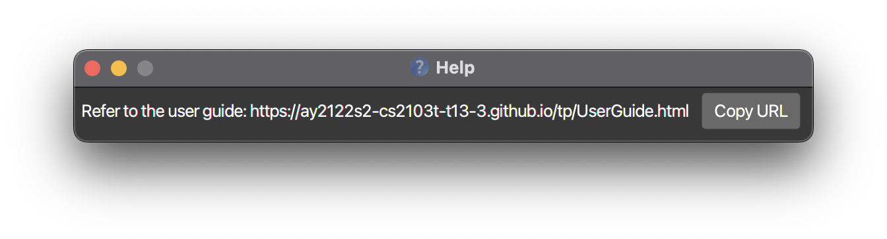

* Table of Contents
{:toc}

--------------------------------------------------------------------------------------------------------------------

## Introduction

**LinkyTime** is a desktop app for NUS students to organize their online meeting links, optimized for use via a Command Line Interface (CLI) while still having the benefits of a Graphical User Interface (GUI). If you can type fast, **LinkyTime** can get your meeting management tasks done faster than traditional GUI apps.

--------------------------------------------------------------------------------------------------------------------

## Quick start

1. Ensure you have Java `11` or above installed in your computer.

2. Download the latest `linkytime.jar` from [here](https://github.com/AY2122S2-CS2103T-T13-3/tp/releases).

3. Copy the file to the folder you want to use as the _home folder_ for the app.

4. Double-click the file to start the app. A GUI similar to the one shown below should appear in a few seconds. Note how the app contains some sample data. 

    

6. Type the command in the command box and press Enter to execute it. e.g. typing **`list`** and pressing Enter will list all the entries. 

    Some example commands you can try:

    * `list` : Lists all meeting entries.
    * `add n/Tutorial u/https://www.zoom.com d/13mar2022 m/CS2103 r/Y t/Boring` : Adds a meeting named `Tutorial` with the module code `CS2103` to the list of meeting entries.
    * `delete 3` : Deletes the 3rd entry shown in the current list.
    * `exit` : Exits the app.

7. Refer to the [Features](#features) below for details of each command.

--------------------------------------------------------------------------------------------------------------------

## Command Format

**:information_source: Notes about the command format:** 

* Words in `UPPER_CASE` are the parameters to be supplied by the user. 
  e.g. in `add u/URL`, `URL` is a parameter which can be used as `add u/https://meet.google.com`.

* Items in square brackets are optional. 
  e.g. `u/URL [t/TAG]` can be used as `u/https://meet.google.com t/midterm` or as `u/https://meet.google.com`.

* Items with `…`​ after them can be used zero or more times. 
  e.g. `[t/TAG]…​` can be used as ` ` (i.e. 0 times), `t/recorded`, `t/recorded t/lecturequiz` etc.

* Parameters can be in any order. 
  e.g. if the command specifies `u/URL n/MEETING_NAME`, `n/MEETING_NAME u/URL` is also acceptable.

* If a parameter is expected only once in the command, but you specified it multiple times, only the last occurrence of the parameter will be taken. 
  e.g. if you specify `n/Lecture n/Tutorial`, only `n/Tutorial` will be taken.

* Extraneous parameters for commands that do not take in parameters (such as `help`, `list`, `exit` and `clear`) will be ignored. 
  e.g. if the command specifies `help 123`, it will be interpreted as `help`.

## Features

This section describes each of the commands and features available in **LinkyTime**.

### Meeting Entry Management

#### Add a meeting entry: `add`

Adds a meeting entry into the entry list.

Format: `add n/MEETING_NAME u/URL d/DATETIME m/MODULE_CODE r/IS_RECURRING [t/TAG]...`

Parameters:

* `MEETING_NAME` The name of the meeting entry.
* `URL` The URL to the online meeting.
* `DATETIME` The date and starting time of the meeting.
* `MODULE_CODE` The module code of the module that the meeting is for.
* `IS_RECURRING` Whether the meeting recurs every week. Given as `Y` or `N`.
* `TAG` The tags associated with the meeting entry.

Examples:

* `add n/Lecture u/https://www.zoom.com d/Friday 2pm m/CS2103 r/Y t/recorded t/lecturequiz`
* `add n/Midterm u/https://www.google.com d/13mar2022 10am m/CS2106 r/N`

#### List all meeting entries : `list`

View all meeting entries in the entry list and display their respective details.

Format: `list`

Details include:

* Meeting url
* Meeting name
* Meeting date and time

#### Delete a meeting entry : `delete`

Deletes the specified meeting entry and all associated fields from the entry list.

Format: `delete INDEX`

* Deletes the meeting entry at the specified `INDEX`.
* The index refers to the index number shown in the displayed entry list.
* The index **must be a positive integer** 1, 2, 3, …​ that is within the range of entries.

Examples:
* `list` followed by `delete 2` deletes the 2nd meeting entry in the entry list.

#### Clearing all entries : `clear`

Clears all meeting entries from the entry list.

Format: `clear`

### General

#### Viewing help : `help`

Shows a message explaining how to access the help page.

Format: `help`

#### Exiting the program : `exit`

Exits the program.

Format: `exit`

#### Saving the data

Your meeting entries are saved to your computer automatically upon running any command that changes the data. There is no need to save manually.

#### Editing the data file

The meeting entries are saved in a JSON file at `[JAR file location]/data/app.json`. Advanced users are welcome to update their entries directly by editing that file.

:exclamation: **Caution:**
If your changes to the data file makes its format invalid, LinkyTime will discard all data and start with an empty data file on the next run.

#### Archiving data files `[coming in v2.0]`

_Details coming soon ..._

--------------------------------------------------------------------------------------------------------------------

## FAQ

**Q**: How do I transfer my data to another Computer? 
**A**: Install the app in the other computer and overwrite the empty `app.json` data file it creates with the equivalent `app.json` data file from your previous LinkyTime installation.

--------------------------------------------------------------------------------------------------------------------

## Command summary

Action | Format, Examples
--------|------------------
**Add** | `add n/MEETING_NAME u/URL d/DATETIME m/MODULE_CODE r/IS_RECURRING [t/TAG]...`   e.g., `add n/Lecture u/https://www.zoom.com d/Friday 2pm m/CS2103 r/Y t/recorded t/lecturequiz`
**List** | `list`
**Delete** | `delete INDEX`  e.g., `delete 3`
**Clear** | `clear`
**Edit** | _Coming soon_
**Find** | _Coming soon_
**Sort** | _Coming soon_
**Open** | _Coming soon_
**Help** | `help`
**Exit** | `exit`
