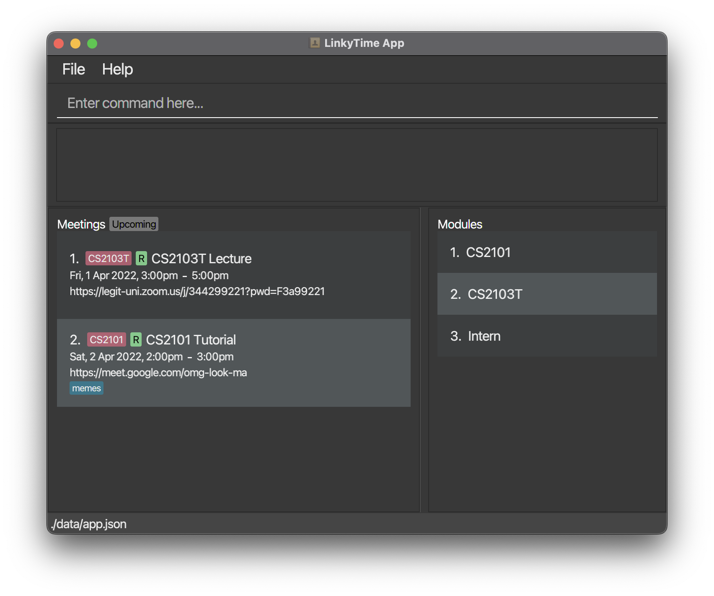

**LinkyTime** is a cross-platform desktop application designed for NUS Computer Science students to efficiently keep track of their online meetings and classes. The application is optimized for use via the Command Line Interface (CLI).

## Quick Start

* If this is your first time using **LinkyTime**, check out the [_Quick Start_ section of the **User Guide**](https://ay2122s2-cs2103t-t13-3.github.io/tp/UserGuide.html#quick-start).
* If you are interested in contributing to **LinkyTime**, the [**Developer Guide**](https://ay2122s2-cs2103t-t13-3.github.io/tp/DeveloperGuide.html) is a good place to start.
* If you would like to learn more about the team behind **LinkyTime**, you may check out [**About Us**](https://ay2122s2-cs2103t-t13-3.github.io/tp/AboutUs.html).

## Acknowledgements

* This project is based on the AddressBook-Level3 project created by the [SE-EDU initiative](https://se-education.org).
* Libraries used: [JavaFX](https://openjfx.io/), [Jackson](https://github.com/FasterXML/jackson), [JUnit5](https://github.com/junit-team/junit5)
* Logo icon adapted from [AkashRajDahal](https://www.svgviewer.dev/s/12130/link).
